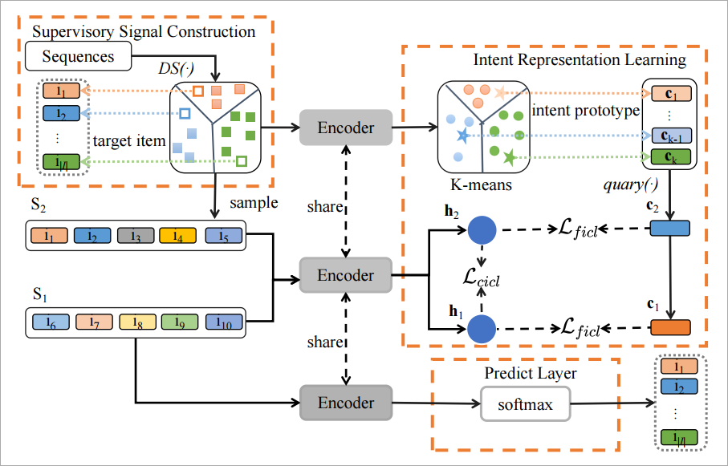

# ICSRec

This is our Pytorch implementation for the paper: "**Intent Contrastive Learning with Cross Subsequences for Sequential Recommendation**".

## Environment  Requirement

* Pytorch>=1.7.0
* Python>=3.7  

## Model Overview

 

## Usage

Please run the following command to install all the requirements:  

```python
pip install -r requirements.txt
```

## Evaluate Model

We provide the trained models on Beauty, Sports_and_Outdoors, Toys_and_Games and ML-1M datasets in `./src/output/<Data_name>`folder. You can directly evaluate the trained models on test set by running:

```
python main.py --data_name <Data_name> --model_idx 0 --do_eval --encoder SAS/GRU
```

On Beauty:

```python
python main.py --data_name Beauty --model_idx 0 --do_eval --encoder SAS
```

```
{'Epoch': 0, 'HIT@5': '0.0698', 'NDCG@5': '0.0494', 'HIT@10': '0.0959', 'NDCG@10': '0.0578', 'HIT@20': '0.1298', 'NDCG@20': '0.0663'}
```

```
python main.py --data_name Beauty --model_idx 0 --do_eval --encoder GRU
```

```
{'Epoch': 0, 'HIT@5': '0.0515', 'NDCG@5': '0.0365', 'HIT@10': '0.0740', 'NDCG@10': '0.0437', 'HIT@20': '0.1014', 'NDCG@20': '0.0506'}
```

On Sports_and_Outdoors:

```python
python main.py --data_name Sports_and_Outdoors --model_idx 0 --do_eval --encoder SAS
```

```
{'Epoch': 0, 'HIT@5': '0.0403', 'NDCG@5': '0.0283', 'HIT@10': '0.0565', 'NDCG@10': '0.0335', 'HIT@20': '0.0794', 'NDCG@20': '0.0393'}
```

```
python main.py --data_name Sports_and_Outdoors --model_idx 0 --do_eval --encoder GRU
```

```
{'Epoch': 0, 'HIT@5': '0.0278', 'NDCG@5': '0.0191', 'HIT@10': '0.0404', 'NDCG@10': '0.0232', 'HIT@20': '0.0596', 'NDCG@20': '0.0280'}
```

On Toys_and_Games:

```python
python main.py --data_name Toys_and_Games --model_idx 0 --do_eval --encoder SAS
```

```
{'Epoch': 0, 'HIT@5': '0.0788', 'NDCG@5': '0.0571', 'HIT@10': '0.1055', 'NDCG@10': '0.0657', 'HIT@20': '0.1368', 'NDCG@20': '0.0736'}
```

```
python main.py --data_name Toys_and_Games --model_idx 0 --do_eval --encoder GRU
```

```
{'Epoch': 0, 'HIT@5': '0.0519', 'NDCG@5': '0.0388', 'HIT@10': '0.0699', 'NDCG@10': '0.0446', 'HIT@20': '0.0950', 'NDCG@20': '0.0509'}
```

On ML-1M:

```python
python main.py --data_name ml-1m --model_idx 0 --do_eval --encoder SAS
```

```
{'Epoch': 0, 'HIT@5': '0.2442', 'NDCG@5': '0.1708', 'HIT@10': '0.3369', 'NDCG@10': '0.2007', 'HIT@20': '0.4518', 'NDCG@20': '0.2297'}
```

```
python main.py --data_name ml-1m --model_idx 0 --do_eval --encoder GRU
```

```
{'Epoch': 0, 'HIT@5': '0.2033', 'NDCG@5': '0.1398', 'HIT@10': '0.2889', 'NDCG@10': '0.1673', 'HIT@20': '0.4045', 'NDCG@20': '0.1964'}
```


## Train Model

Please train the model using the Python script `main.py`.

You can run the following command to train the model on Beauty datasets:

```
python main.py --data_name Beauty --rec_weight 1. --lambda_0 0.3 --beta_0 0.1 --f_neg --intent_num 256 
```
or

You can use the training scripts in the `./src/scrips` folder to train the model 
```angular2html
bash beauty.sh
bash ml-1m.sh
bash sports.sh
bash toys.sh
```
## Acknowledgment

- Transformer and training pipeline are implemented based on [CoSeRec](https://github.com/salesforce/CoSeRec) and [ICLRec](https://github.com/salesforce/ICLRec). Thanks them for providing efficient implementation.


## Citation

```
@misc{qin2023intent,
      title={Intent Contrastive Learning with Cross Subsequences for Sequential Recommendation}, 
      author={Xiuyuan Qin and Huanhuan Yuan and Pengpeng Zhao and Guanfeng Liu and Fuzhen Zhuang and Victor S. Sheng},
      year={2023},
      eprint={2310.14318},
      archivePrefix={arXiv},
      primaryClass={cs.IR}
}

```
- Please kindly cite our paper if this paper and the code are helpful. 

