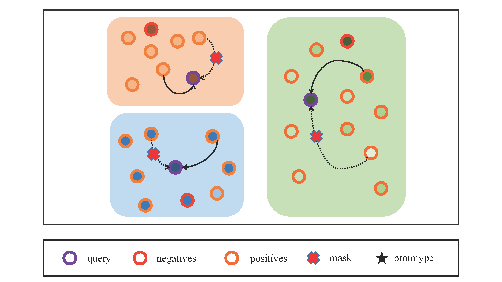
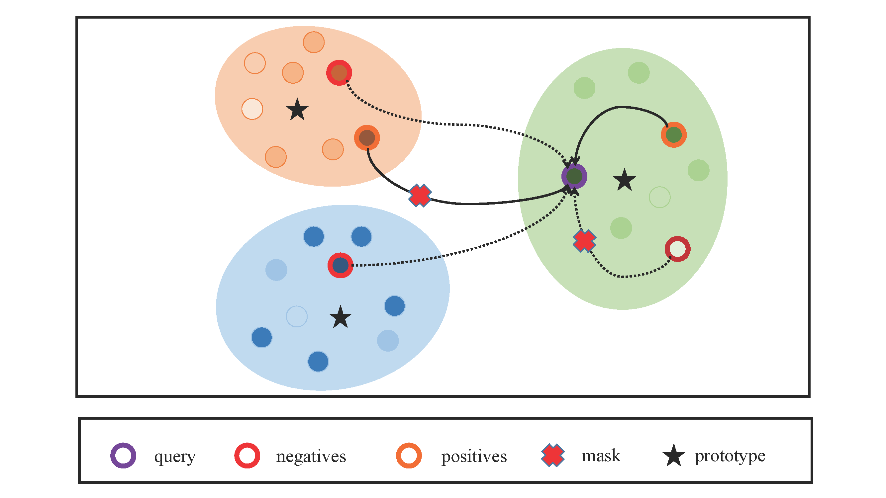

- 
- 
- Why we need False Negative Mask in CICL and FICL tasks?
  - In the CICL task, within the same batch, there may be multiple sub-sequences with the same target item. To prevent the introduction of false negative items during the contrastive learning process, masking is performed directly.
  -  In the FICL task, within a batch, there may be multiple sub-sequences belonging to the same fine-grained intent category (i.e., located within the same cluster). To avoid introducing false negative items, masking is also performed directly.

